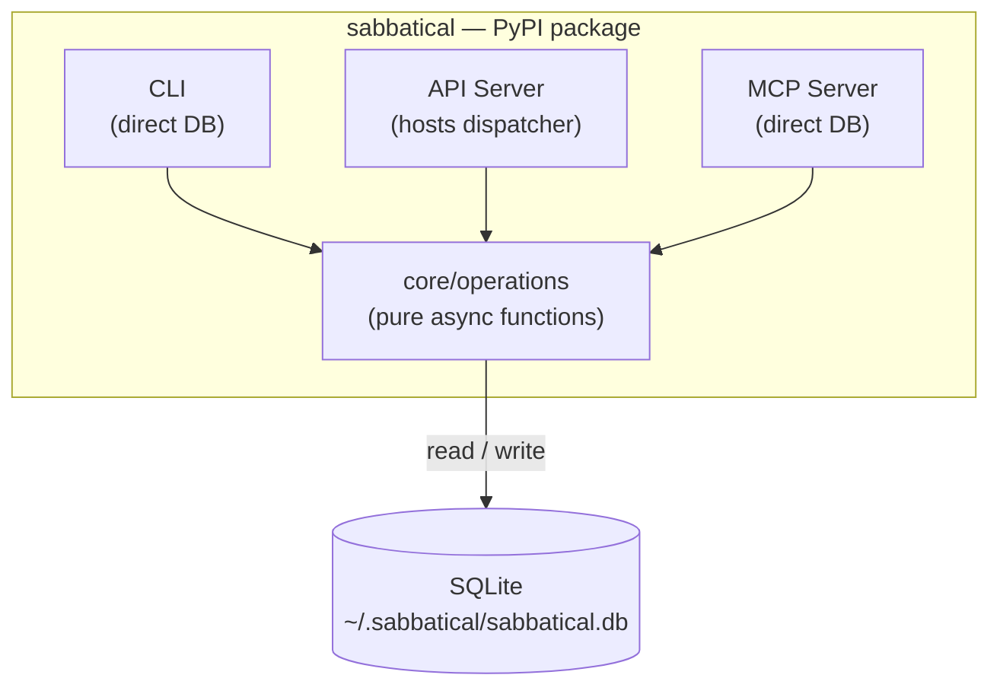

# Refactor Plan: Core Library + Thin Wrappers + Direct DB Access

## Goal

Two concurrent objectives:

1. **Refactor core into a library** — all business logic and validation lives in `core/operations/`, surfacing typed exceptions
2. **Make CLI, API, and MCP thin wrappers** over core — each surfaces errors in its own way; none contains business logic

Storage stays on **SQLite with WAL mode**. Adding `busy_timeout` handles concurrent writes from multiple processes (CLI + server). No new infrastructure dependencies.

---

## Target Architecture



**Key rules:**
- SQLite with WAL mode + `busy_timeout` handles concurrent writes from CLI, API, and MCP processes
- Core operations are pure async functions: accept a `db` handle, return data or raise typed exceptions
- **Validation at every level:** core operations validate all invariants (state machine, FK existence, uniqueness). Wrappers add their own input validation for fail-fast feedback (e.g., Pydantic models in API, Typer type checks in CLI, parameter validation in MCP) before calling core operations
- CLI, API, and MCP each catch core exceptions and surface them their own way
- The dispatcher still lives in the API server process (the only persistent process)
- CLI and MCP no longer require the server to be running for read OR write operations (including preempt/cancel)
- The dispatcher is stateless — no in-memory worker tracking; liveness is DB-driven via heartbeats
- Cancellation is cooperative: any process writes `cancel_requested` to the DB, workers self-terminate on next heartbeat check

---

## File Map

```
src/sabbatical/
├── core/
│   ├── config.py                 UNCHANGED
│   ├── db.py                     MODIFY   — add busy_timeout pragma, add get_database_sync for CLI/MCP
│   ├── exceptions.py             CREATE   — typed exception hierarchy
│   ├── operations/               CREATE   — all business logic lives here
│   │   ├── __init__.py
│   │   ├── organizations.py
│   │   ├── agents.py
│   │   ├── tasks.py
│   │   ├── runs.py
│   │   └── status.py
│   ├── dispatcher.py             UNCHANGED — already stateless
│   ├── worker.py                 UNCHANGED — keeps raw SQL (see note below)
│   ├── context_builder.py        MINOR    — use shared build_agent_tree from operations
│   ├── description_generator.py  UNCHANGED
│   ├── cost.py                   UNCHANGED
│   ├── tag_parser.py             UNCHANGED
│   ├── agent/                    UNCHANGED
│   └── logging_setup.py          UNCHANGED
├── api/
│   ├── app.py                    UNCHANGED
│   ├── schemas.py                UNCHANGED
│   ├── broadcast.py              UNCHANGED
│   ├── dependencies.py           UNCHANGED
│   └── routers/                  REWRITE  — thin wrappers delegating to core/operations
│       ├── _errors.py            CREATE   — shared exception-to-response mapping
│       ├── organizations.py
│       ├── agents.py
│       ├── tasks.py
│       ├── runs.py
│       └── status.py
├── cli/
│   ├── main.py                   MINOR    — add shared db/async helpers
│   ├── _context.py               CREATE   — shared db helper + async run helper
│   ├── _errors.py                CREATE   — shared error handler
│   ├── server_cmds.py            UNCHANGED
│   ├── org_cmds.py               REWRITE  — call core.operations directly
│   ├── agent_cmds.py             REWRITE  — call core.operations directly
│   ├── task_cmds.py              REWRITE  — call core.operations directly
│   ├── run_cmds.py               REWRITE  — call core.operations directly
│   └── formatters.py             UNCHANGED
├── mcp/
│   └── server.py                 REWRITE  — call core.operations directly
├── migrations/                   KEEP     — Alembic stays for schema evolution
└── web/                          UNCHANGED

pyproject.toml                    MINOR    — version bump
alembic.ini                       UNCHANGED
```

---

## Phase 1 — Core as Library

### 1.1 `core/db.py` — add busy_timeout + shared connection helper

Add `PRAGMA busy_timeout=5000` to the pragma pool so concurrent writers (CLI + server) retry automatically instead of raising `SQLITE_BUSY`:

```python
class _PragmaPool:
    async def acquire(self):
        conn = await self._pool.acquire()
        await conn.execute("PRAGMA foreign_keys=ON")
        await conn.execute("PRAGMA journal_mode=WAL")
        await conn.execute("PRAGMA busy_timeout=5000")
        return conn
```

Add a helper for CLI/MCP processes that need a database connection:

```python
async def get_database_from_config() -> databases.Database:
    """Create a database connection using the default config path.

    Used by CLI and MCP processes that connect directly to the DB
    without going through the API server. Includes a schema version
    check — raises if the DB is behind the expected Alembic revision.
    """
    config = load_config()
    db = await get_database(config.server.db_path)
    await _check_schema_version(db)
    return db


async def _check_schema_version(db) -> None:
    """Verify the DB schema is up to date. Raises if migrations are pending."""
    row = await db.fetch_one("SELECT version_num FROM alembic_version")
    if not row or row["version_num"] != EXPECTED_REVISION:
        await db.disconnect()
        raise SchemaError(
            "Database schema is outdated. Run `sabbatical server up` to apply migrations."
        )
```

This prevents CLI/MCP from operating on a stale schema after a package upgrade. Instead of hardcoding an `EXPECTED_REVISION` constant (fragile — easy to forget updating it with each migration), use Alembic's `ScriptDirectory.get_current_head()` at runtime to read the expected head from the migration files that ship in the package:

```python
from alembic.config import Config as AlembicConfig
from alembic.script import ScriptDirectory

def _get_expected_revision() -> str:
    alembic_cfg = AlembicConfig()
    alembic_cfg.set_main_option("script_location", str(Path(__file__).parent.parent / "migrations"))
    return ScriptDirectory.from_config(alembic_cfg).get_current_head()
```

This stays in sync automatically — no manual constant to maintain.

### 1.2 `core/exceptions.py` — create

```python
class SabbaticalError(Exception):
    """Base class for all errors raised by core operations."""


class NotFoundError(SabbaticalError):
    def __init__(self, resource: str, identifier: str):
        self.resource = resource
        self.identifier = identifier
        super().__init__(f"{resource} '{identifier}' not found.")


class ConflictError(SabbaticalError):
    """A state machine violation or uniqueness conflict.

    Examples: commenting on an in_progress task, creating a duplicate agent name.
    """


class ValidationError(SabbaticalError):
    """An input value failed validation.

    Examples: workspace path does not exist, name not snake_case.
    """
    def __init__(self, field: str, message: str):
        self.field = field
        super().__init__(f"{field}: {message}")


class PreconditionError(SabbaticalError):
    """A required precondition was not met.

    Examples: creating a task in an org with no root agent.
    """


class SchemaError(SabbaticalError):
    """Database schema is outdated. Raised by get_database_from_config()."""
```

These four exception types map cleanly to HTTP status codes in the API layer:

| Exception | HTTP status |
|-----------|------------|
| `NotFoundError` | 404 |
| `ConflictError` | 409 |
| `ValidationError` | 422 |
| `PreconditionError` | 412 |
| `SchemaError` | N/A (raised at connection time, not during requests) |

### 1.3 `core/operations/` — create

One module per resource. Each module contains pure async functions that:
- Accept `db: databases.Database` as the first argument
- Perform validation and raise typed exceptions for all failure modes
- Return plain dicts that match the current Pydantic response model shapes (e.g., `TaskSummary`, `AgentDetail`). Operations own the dict shape; API routers can optionally wrap in `response_model` for OpenAPI docs but don't reshape data. `api/schemas.py` becomes response-model-only — not used inside operations
- Timestamp fields are returned as ISO 8601 strings (e.g., `"2024-01-01T00:00:00.000000"`), matching the raw SQLite storage format. Pydantic parses ISO strings into `datetime` objects automatically. CLI and MCP serialize them as-is
- Have no knowledge of HTTP, CLI formatting, or MCP protocol
- Use the same SQL queries that exist today in the routers — no query changes needed

#### `core/operations/organizations.py`

```python
async def create_organization(db, name: str, workspace_path: str, description: str | None = None) -> dict
async def list_organizations(db) -> list[dict]
async def get_organization(db, name: str) -> dict          # includes agent tree
async def update_organization(db, name: str, workspace_path: str | None, description: str | None) -> dict
async def delete_organization(db, name: str) -> None
def build_agent_tree(agents_list: list[dict]) -> list[dict]  # shared tree builder
```

Validation that moves from API router into here:
- `workspace_path` must be an absolute path
- Organization name uniqueness check
- On delete: block if any tasks are `in_progress`, then handle FK ordering (clear boss refs before deleting agents, then delete org — cascades handle the rest)

`build_agent_tree` is a shared utility that converts a flat list of agent dicts into a nested hierarchy. Used by `get_organization` (for the API/CLI/MCP response) and by `context_builder.py` (for agent prompts). Replaces the duplicated `_build_tree()` in the organizations router and `build_tree_dict()` in `context_builder.py`.

Each node dict in the tree includes: `name`, `description`, `instructions_path`, `max_iterations`, `model`, `is_removed`, `subordinates`. The `boss` field is **excluded** from tree nodes — hierarchy is expressed by nesting. This matches the current `AgentNode` Pydantic schema so the API response shape is unchanged.

#### `core/operations/agents.py`

```python
async def create_agent(db, config, organization: str, name: str, instructions_path: str, boss: str | None, max_iterations: int | None, model: str | None) -> dict
    # Note: if a soft-deleted agent with the same name exists (is_removed=1),
    # this resurrects it — resets all fields and clears is_removed.
    # Otherwise does a normal INSERT. Matches the current upsert behavior.
async def list_agents(db, organization: str, include_removed: bool = False) -> list[dict]
async def get_agent(db, organization: str, name: str) -> dict    # includes instructions_content, subordinates, cost
async def update_agent(db, config, organization: str, name: str, boss=_UNSET, instructions_path=_UNSET, max_iterations=_UNSET, model=_UNSET) -> dict
async def remove_agent(db, organization: str, name: str) -> dict  # soft-delete, promote subordinates
    # Returns {"name": ..., "organization": ..., "is_removed": True, "warnings": [...]}
    # warnings contains strings like "Subordinate 'x' promoted to root" for each re-parented agent
```

`update_agent` uses a sentinel `_UNSET = object()` to distinguish "field not provided" from "field explicitly set to None." Fields left as `_UNSET` are not touched; fields set to `None` clear the value (e.g., `boss=None` promotes to root). This preserves the current `model_dump(exclude_unset=True)` semantics from the API router.

Validation that moves here:
- `instructions_path` must point to an existing file
- `boss` must be an active agent in the same org (if provided)
- Cannot remove an agent assigned to active tasks
- Agent name uniqueness within org
- Agent cannot be its own boss
- Cannot update agent assigned to an in_progress task

`config` is needed for `dispatcher.default_max_iterations` (agent creation default) and for description generation.

Description generation: `create_agent` and `update_agent` return immediately. The caller (API router, CLI, MCP) is responsible for triggering description generation. The API router uses `BackgroundTasks`. The CLI `await`s description generation synchronously before disconnecting the DB (using `asyncio.create_task` would silently cancel when `asyncio.run()` exits). MCP uses `asyncio.create_task` (safe because the MCP event loop is long-lived).

**UX note:** CLI `agent add` will be noticeably slower than the API equivalent because it blocks on description generation. This is unavoidable given `asyncio.run()` semantics. If it becomes a pain point, add a `--no-description` flag to skip generation.

A shared helper is provided:

```python
async def generate_and_store_description(db, config, agent_name: str, organization: str, instructions_path: str) -> None:
    """Generate an agent description and store it. Safe to run as a background task."""
    description = await generate_description(instructions_path, config)
    if description:
        await db.execute(
            "UPDATE agents SET description = :description WHERE name = :name AND organization_name = :org",
            {"description": description, "name": agent_name, "org": organization},
        )
```

#### `core/operations/tasks.py`

```python
async def create_task(db, organization: str, title: str, description: str | None = None) -> dict
async def list_tasks(db, organization: str | None, status: str | None, assignee: str | None) -> list[dict]
async def get_task(db, task_id: str) -> dict                  # includes timeline (comments + run summaries)
async def add_comment(db, task_id: str, body: str) -> dict
async def preempt_task(db, task_id: str) -> dict
async def complete_task(db, task_id: str) -> dict
async def reopen_task(db, task_id: str) -> dict
async def retry_task(db, task_id: str, assignee: str | None = None) -> dict
async def cancel_task(db, task_id: str) -> dict
```

All state machine validation moves here. `ConflictError` is raised for invalid transitions. Specific preconditions per operation:

Key patterns:
- `add_comment` → raises `ConflictError` if task status is `in_progress`, `done`, or `canceled`. Commenting is allowed on `open` and `failed` tasks only. Parses @tags, validates route targets, updates assignee/status if valid tag found
- `complete_task` → raises `ConflictError` unless `status in ('open', 'failed') AND assignee == 'user'`. Only user-assigned tasks can be marked done
- `reopen_task` → raises `ConflictError` unless `status in ('done', 'canceled')`
- `retry_task` → raises `ConflictError` unless `status in ('done', 'failed')`. If no `assignee` provided, falls back to the agent from the most recent run. If no prior run exists either, raises `PreconditionError`. Validates the target agent exists and is not removed (`is_removed = 0`)
- `preempt_task` → sets `cancel_requested = 1` on the running run. Does **NOT** change the run's `status` — it stays `running` until the worker self-terminates and marks it `preempted`. The operation only changes the task's status to `open` and assignee to `user`
- `cancel_task` → same cooperative cancellation pattern but sets task status to `canceled`. Returns `{"id": ..., "status": "canceled", "assignee": "user", "preempted_run": run_id | None}` — `preempted_run` is the ID of the run flagged for cancellation, or `None` if the task wasn't in progress
- `list_tasks` → includes cost data (via `sum_run_costs`), elapsed time for running tasks, total duration for completed tasks. Same SQL queries as today.

The `handle_routing` function used by `worker.py` stays in `worker.py` — it's worker-internal logic, not a user-facing operation.

**Note on `worker.py` raw SQL:** `worker.py` contains ~20 raw SQL statements (comment insertion, run updates, task status changes, heartbeat, routing). It deliberately bypasses `core/operations` because it operates in a privileged, dispatcher-spawned context with different error semantics: worker errors are logged to the comment thread and the run is marked failed, rather than raising exceptions to a user-facing layer. Routing these through operations would add try/except overhead with no benefit since the worker already handles its own failure modes. This is a deliberate exception, not a gap to be closed later.

#### `core/operations/runs.py`

```python
async def list_runs(db, task_id: str) -> list[dict]
async def get_run(db, run_id: str) -> dict               # includes execution steps
```

Read-only operations. `get_run` parses the JSON `execution_steps` field.

Validation:
- `list_runs` raises `NotFoundError(resource="task", identifier=task_id)` if the task doesn't exist
- `get_run` raises `NotFoundError(resource="run", identifier=run_id)` if the run doesn't exist

#### `core/operations/status.py`

```python
async def get_status(db, config) -> dict
```

Returns task counts by status, active worker count (from DB), max concurrency (from config), token consumption, and total cost. Active worker count uses `SELECT COUNT(*) FROM runs WHERE status = 'running'`.

**Note on `"server": "running"` field:** `get_status` returns DB-derived data only — it does NOT include a `"server"` field. The API router adds `"server": "running"` to the response dict before returning (meaningful only when called through the API). The CLI `server status` command gets this field from the HTTP response (it still calls the API for server status). CLI/MCP calling `get_status` directly will not see this field — correct since there's no server in their context.

### 1.4 Two-level validation strategy

**Core operations** own all business invariants — these are the authoritative checks:
- Task state machine transitions (open → in_progress → done, etc.)
- Comment routing tag resolution (calls `tag_parser.resolve_first_valid_tag`)
- Agent boss hierarchy checks
- Organization existence checks before agent/task creation
- Workspace path validation
- In-progress task checks before agent removal or org deletion

**Wrappers** add fail-fast input validation for immediate user feedback:
- **API:** Pydantic request models (`TaskCreate`, `AgentUpdate`, etc.) validate field types, required fields, `snake_case` format — before the request reaches core operations
- **CLI:** Typer type annotations and `typer.Option` constraints catch missing/malformed arguments at the command-line level
- **MCP:** Parameter type annotations and docstrings guide LLM callers; explicit checks on required fields before calling core

This means some checks happen twice (e.g., API Pydantic validates `name` is snake_case, then core validates it again). That's intentional — wrappers give fast, transport-appropriate feedback; core guarantees consistency regardless of which wrapper calls it. The API routers will contain zero `if not x: return JSONResponse(...)` blocks — only Pydantic validation and `try/except SabbaticalError`.

---

## Phase 2 — Thin Wrappers

### 2.1 Shared exception-to-response mapping (API)

Register a global exception handler on the FastAPI app so routers don't need any try/except blocks at all. The helper maps core exceptions to HTTP responses:

```python
# api/routers/_errors.py
from fastapi.responses import JSONResponse
from sabbatical.core.exceptions import NotFoundError, ConflictError, ValidationError, PreconditionError

def core_error_response(e: Exception) -> JSONResponse:
    if isinstance(e, NotFoundError):
        return JSONResponse(status_code=404, content={"message": str(e)})
    if isinstance(e, ConflictError):
        return JSONResponse(status_code=409, content={"message": str(e)})
    if isinstance(e, ValidationError):
        return JSONResponse(status_code=422, content={"message": str(e)})
    if isinstance(e, PreconditionError):
        return JSONResponse(status_code=412, content={"message": str(e)})
    raise e  # unexpected — let FastAPI's 500 handler take it
```

Register the handler in `app.py`:

```python
# api/app.py
from sabbatical.core.exceptions import SabbaticalError
from .routers._errors import core_error_response

app.add_exception_handler(SabbaticalError, core_error_response)
```

With the global handler, router endpoints become trivially thin — no try/except needed:

```python
# api/routers/tasks.py — after refactor
from sabbatical.core.operations import tasks as task_ops

@router.post("/tasks", status_code=201)
async def create_task(payload: TaskCreate, db=Depends(get_db)):
    return await task_ops.create_task(db, payload.organization, payload.title, payload.description)

@router.get("/tasks/{id}")
async def get_task(id: str, db=Depends(get_db)):
    return await task_ops.get_task(db, id)
```

Agent endpoints that trigger description generation use `BackgroundTasks`:

```python
@router.post("/organizations/{organization}/agents", status_code=201)
async def add_agent(
    organization: str,
    agent: AgentCreate,
    background_tasks: BackgroundTasks,
    db=Depends(get_db),
    config=Depends(get_config),
):
    result = await agent_ops.create_agent(db, config, organization, agent.name, ...)
    background_tasks.add_task(
        agent_ops.generate_and_store_description, db, config, agent.name, organization, agent.instructions_path
    )
    return result
```

### 2.2 SSE streaming — stays in the router

The `GET /runs/{run_id}/stream` endpoint is transport-specific (SSE) and depends on the in-memory `RunEventBroadcaster`. It stays in `api/routers/runs.py` as-is — it's the one endpoint that isn't a thin wrapper over a core operation. The read operations (`list_runs`, `get_run`) delegate to `core/operations/runs.py`.

**Known limitation:** When CLI or MCP modify tasks directly (bypassing the API), SSE clients won't see real-time updates. For example, if someone is watching a run stream while another user cancels via CLI, there's no broadcast notification — the SSE client will only see the effect on the next poll or when the worker itself terminates. This is acceptable since SSE is primarily used to follow active run output, and cooperative cancellation still works correctly at the DB level.

### 2.3 `api/dependencies.py`

Unchanged. `get_db`, `get_config`, `get_dispatcher`, and `get_broadcaster` stay as they are. The dispatcher is only referenced in `app.py` (lifespan) and the `/shutdown` endpoint.

### 2.4 CLI — direct core calls

Add shared helpers for CLI database access and async execution:

```python
# cli/_context.py
import asyncio
from contextlib import asynccontextmanager
from sabbatical.core.db import get_database_from_config

def run(coro):
    """Run a coroutine from synchronous Typer command context."""
    return asyncio.run(coro)

@asynccontextmanager
async def open_db():
    """Open and yield a database connection, ensuring disconnect on exit."""
    db = await get_database_from_config()
    try:
        yield db
    finally:
        await db.disconnect()
```

```python
# cli/_errors.py
import typer
from sabbatical.core.exceptions import SabbaticalError

def handle_error(e: Exception) -> None:
    """Handle errors from core operations and DB access.

    Catches SabbaticalError (including SchemaError) and sqlite3.OperationalError
    (e.g., busy_timeout exceeded). Re-raises unexpected exceptions.
    """
    if isinstance(e, SabbaticalError):
        typer.echo(f"Error: {e}", err=True)
    elif "database is locked" in str(e):
        typer.echo("Error: Database is locked. Is another process holding a long write?", err=True)
    else:
        raise e
    raise typer.Exit(1)
```

Each CLI command module is rewritten to call operations directly:

```python
# cli/task_cmds.py — after refactor (representative example)
from sabbatical.core.operations import tasks as task_ops
from sabbatical.core.exceptions import SabbaticalError
from ._context import open_db, run
from ._errors import handle_error
from .formatters import format_task_detail, format_task_list

@task_app.command("create")
def create(
    title: str,
    organization: str = typer.Option(..., "--organization", "-o"),
    description: str | None = typer.Option(None, "--description", "-d"),
    description_file: str | None = typer.Option(None, "--description-file", help="Path to detailed spec"),
):
    async def _run():
        desc = description
        if description_file:
            with open(description_file, "r") as f:
                desc = f.read()
        async with open_db() as db:
            return await task_ops.create_task(db, organization, title, desc)

    try:
        task = run(_run())
        typer.echo(f"Created {task['id']}")
    except Exception as e:
        handle_error(e)

@task_app.command("list")
def list_tasks(
    organization: str | None = typer.Option(None, "--organization", "-o"),
    status: str | None = typer.Option(None, "--status"),
):
    async def _run():
        async with open_db() as db:
            return await task_ops.list_tasks(db, organization, status, None)

    try:
        tasks = run(_run())
        typer.echo(format_task_list(tasks))
    except Exception as e:
        handle_error(e)
```

The same pattern applies to `org_cmds.py`, `agent_cmds.py`, and `run_cmds.py`. `run_cmds.py` calls `run_ops.list_runs()` and `run_ops.get_run()` directly — same pattern as task commands.

**Preserve existing UX behaviors:** Destructive CLI commands (`organization delete`, `agent remove`) must retain their `typer.confirm()` confirmation prompts and `--yes/-y` bypass flags. Update the `organization delete` prompt text to remove the stale "chat sessions" reference.

All CLI commands work without the API server running, including `task preempt` and `task cancel`. These write `cancel_requested = 1` to the DB; the worker self-terminates on its next heartbeat check.

The only commands that require the API server are under the `server` subcommand (`sabbatical server up/down/logs/status`). `server status` does two things: (1) checks the PID file to confirm the process is alive, (2) calls `GET /api/status` to confirm the server is responding and to retrieve dispatcher state. All other `server` subcommands manage the server process and stay HTTP-based.

### 2.5 MCP server — direct core calls

The MCP server creates a single DB connection in its lifespan (same pattern as the current `httpx.AsyncClient`). Tools use the shared connection — no per-call open/close:

```python
# mcp/server.py — after refactor (representative example)
import json
from contextlib import asynccontextmanager
from mcp.server.fastmcp import FastMCP
from sabbatical.core.operations import tasks as task_ops, organizations as org_ops
from sabbatical.core.exceptions import SabbaticalError
from sabbatical.core.db import get_database_from_config

_db = None

@asynccontextmanager
async def lifespan(server: FastMCP):
    global _db
    _db = await get_database_from_config()
    yield
    await _db.disconnect()
    _db = None

mcp = FastMCP(
    name="sabbatical",
    instructions="Sabbatical is a local AI agent orchestration system. ...",
    lifespan=lifespan,
)

@mcp.tool()
async def create_task(title: str, organization: str, description: str = "") -> str:
    try:
        task = await task_ops.create_task(_db, organization, title, description or None)
        return json.dumps(task)
    except SabbaticalError as e:
        return json.dumps({"error": str(e)})

@mcp.tool()
async def get_task(task_id: str) -> str:
    try:
        task = await task_ops.get_task(_db, task_id)
        return json.dumps(task)
    except SabbaticalError as e:
        return json.dumps({"error": str(e)})
```

All 22 MCP tools follow this pattern. MCP-level validation (required field checks, type annotations) provides fail-fast feedback before calling core operations.

**Known limitation — MCP update ambiguity:** MCP tool parameters cannot distinguish "not provided" from "explicitly `None`." This means `update_agent` via MCP cannot clear `boss` (promote to root). Workaround: use the CLI or API for this operation. This limitation exists today (MCP proxies through the API with the same ambiguity) and is not a regression.

**Known limitation — global `_db` resilience:** The module-level `_db` global has no reconnect logic. If the SQLite connection drops or the lifespan fails to initialize, every tool call hits an assertion error with no recovery path. This matches the current `_http_client` pattern (which also has no reconnect) and is acceptable for a local tool. If it becomes a problem, add a `_ensure_db()` helper that reconnects lazily.

---

## Phase 3 — PyPI Packaging

### 3.1 What ships in the package

```
pip install sabbatical  →  installs:
  • sabbatical CLI                (entry point: sabbatical)
  • sabbatical MCP server         (entry point: sabbatical-mcp)
  • Core library                  (importable: sabbatical.core)
  • API server                    (started by server up, not used directly)
  • Web UI                        (served by API server)
```

No Docker, no MongoDB, no external infrastructure. Just `pip install` and go.

### 3.2 Final `pyproject.toml`

```toml
[project]
name = "sabbatical"
version = "0.2.0"
requires-python = ">=3.12,<4.0"

dependencies = [
    "fastapi>=0.111.0",
    "uvicorn[standard]>=0.30.0",
    "databases[aiosqlite]>=0.9.0",
    "sqlalchemy>=2.0.0",
    "alembic>=1.13.0",
    "pydantic>=2.7.0",
    "typer[all]>=0.12.0",
    "httpx>=0.27.0",
    "sse-starlette>=2.1.0",
    "google-adk[extensions]>=0.1.0",
    "mcp>=1.26.0",
]

[project.scripts]
sabbatical = "sabbatical.cli.main:app"
sabbatical-mcp = "sabbatical.mcp.server:main"
```

### 3.3 First-run experience after refactor

```bash
# Install
pip install sabbatical

# Configure
export OPENROUTER_API_KEY=sk-or-...

# Start server (only needed for the dispatcher to pick up tasks)
sabbatical server up

# Create and manage — all work WITHOUT the server running
sabbatical organization create myproject --workspace-path ~/myproject
sabbatical agent add lead --organization myproject --instructions ./agents/lead.md
sabbatical task create "Build the feature" --organization myproject
sabbatical task list
sabbatical task view MYPR-0001
sabbatical task cancel MYPR-0001   # writes cancel_requested, worker self-terminates
sabbatical organization list
```

### 3.4 Data location

```
~/.sabbatical/
├── config.toml                  # server + dispatcher + llm config
├── sabbatical.db                # SQLite database (WAL mode)
├── sabbatical.pid               # API server PID
└── logs/
    └── sabbatical.log           # API server log
```

Unchanged from today.

---

## Implementation Sequence

Execute phases in this order. Do not begin a phase until the previous one is tested.

| Step | Scope | Risk | Notes |
|------|-------|------|-------|
| -1 | Commit pending heartbeat/cancel migration + dispatcher/worker changes | None | Foundation for everything else. These changes must land first since integration tests depend on the new columns |
| 0 | Write integration tests | — | Safety net for everything else. Cover task lifecycle, dispatcher claim, agent CRUD, cascade deletes |
| 1a | `core/db.py` add `busy_timeout` pragma | None | One line addition |
| 1b | `core/exceptions.py` | None | No dependencies, no risk |
| 1c | `core/operations/organizations.py` | Low | Start here — simplest entity. Immediately after: update `context_builder.py` to use `build_agent_tree` |
| 1d | `core/operations/agents.py` | Low | Includes description generation helper |
| 1e | `core/operations/tasks.py` | Medium | Most complex; carries state machine + routing logic |
| 1f | `core/operations/runs.py` + `core/operations/status.py` | Low | Read-only operations |
| 2a | `api/routers/` thin wrappers + `_errors.py` | Low | Delegate to operations; verify API parity |
| 2b | `cli/` direct calls + `_context.py` + `_errors.py` | Low | All commands work without server |
| 2c | `mcp/server.py` direct calls | Low | Same pattern as CLI |
| 3 | `pyproject.toml` + packaging verification | Low | `pip install -e .` + verify |

---

## Key Technical Risks

### Risk 1 — Operations parity with current API (Step 1e/2a) ★★

The `core/operations/tasks.py` module must reproduce the exact behavior of the current `api/routers/tasks.py` — including edge cases like the multi-tag warning comment, boss escalation in `handle_routing`, and the system comment on silent agent completion. Audit the current router line by line before writing the operation.

### Risk 2 — CLI concurrent writes (Step 2b) ★

CLI and MCP processes write to the same SQLite file as the running server. WAL mode + `busy_timeout=5000` handles this — SQLite retries automatically for up to 5 seconds before raising `SQLITE_BUSY`. This is conservative given writes are sub-millisecond. If issues arise, the timeout can be increased.

### Risk 3 — CLI database connection lifecycle (Step 2b) ★

Each CLI command opens and closes a `databases.Database` connection. The connection must be properly disconnected in all paths (success, error, keyboard interrupt). The `async try/finally` pattern in `_context.py` handles this.

### Risk 4 — Schema drift after package upgrade (Step 1a) ★

CLI/MCP connect directly to the DB. If the user upgrades the package but hasn't restarted the server, the schema could be out of date. `get_database_from_config()` checks the Alembic version and raises a clear error if migrations are pending.

### Risk 5 — Tag-resolution logic duplication (Step 1e) ★

`worker.py` contains routing logic (`handle_routing`) that resolves @tags and validates target agents — overlapping with what `core/operations/tasks.py:add_comment` will do. If these diverge over time, there are two sources of truth for "how does @tag routing work." Extract the shared tag-resolution logic (resolve tag → validate agent exists → determine target) into a utility in `core/` that both `worker.py` and `operations/tasks.py` can call.

### Risk 6 — Rollback strategy ★

Each phase should be independently deployable. If Phase 2 is half-done and a bugfix is needed, partial refactors shouldn't block shipping. Keep each step in its own commit. Phase 1 (core operations) can coexist with the old routers — routers can be migrated one at a time. Avoid big-bang rewrites within a phase.

### ~~Risk 7 — CLI preempt requires API server~~ RESOLVED

Cancellation is DB-driven. CLI writes `cancel_requested = 1` to the runs table; the worker picks it up on its next heartbeat check and self-terminates. No dispatcher involvement needed.

---

## Breaking Changes

This refactor is a **non-breaking change** for:
- Existing SQLite databases (one migration required for `last_heartbeat` + `cancel_requested` columns — this is a prerequisite, not part of the refactor itself)
- The HTTP API contract (same endpoints, same request/response shapes)
- Users' `config.toml` files (no config key changes)

Behavioral change:
- CLI commands (except `server *`) no longer require the API server to be running — they connect directly to the SQLite database
- MCP server no longer proxies through the API — it connects directly to the SQLite database

Suggested version: **0.2.0** (new capability, no breaking changes).
